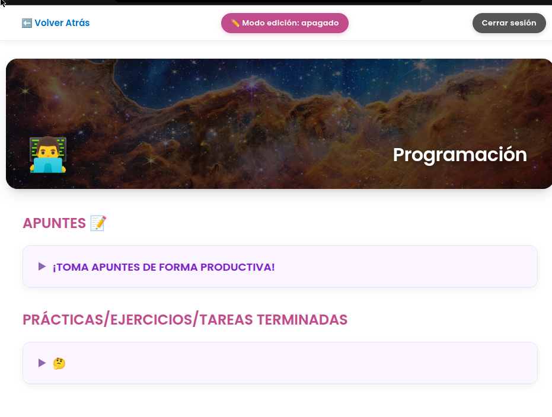

# Grados Informáticos - Visualización progreso Natalia

    
  <a href="https://nataliagamezbarea.github.io/Acceso_grados_informaticos/modulos/login.html"><strong>Visita el sitio web</strong></a>

Esta plataforma web está diseñada para centralizar, seguir y visualizar en tiempo real el progreso académico de los ciclos formativos de Informática de **Grado Medio** y **Grados Superiores** (DAW, DAM, ...), permitiendo consultar en un único espacio todas las asignaturas por trimestres, acceder a apuntes y ejercicios resueltos, previsualizar y descargar documentos (PDFs, Markdown, código), gestionar la visibilidad de contenidos mediante un Modo Edición y acceder de forma inmediata como Invitado o mediante autenticación segura con Supabase y OAuth.

Esto permite que haya privacidad de nombre de profesores no se puedan visualizar y otros archivos que por privacidad no voy a mostrar.

Todo este contenido se ha obtenido mediante un script de classroom que recolecta todos los trabajos entregados cada año.

## Roles de Acceso

- **Invitado**: Entrada rápida con un clic para consultar asignaturas, apuntes y tareas públicas sin necesidad de registro.
- **Administrador**: Inicio de sesión (Email, Google, GitHub) con **Modo Edición** para ocultar temas y prácticas en tiempo real.

## Visor DSD integrado
El visor administrativo de documentos vive dentro de `visor-admin/` como módulo interno de la aplicación principal. Se abre desde las tareas mediante el modal integrado y recibe rama, asignatura, trimestre y archivo. No requiere servidor Python. Los archivos de autenticación/configuración duplicados del visor independiente se han eliminado; el módulo usa la sesión de Supabase del mismo proyecto.
